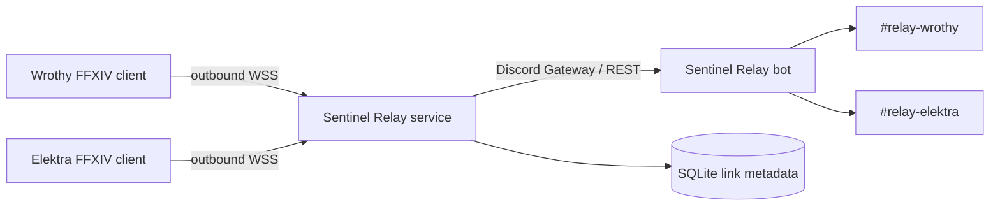
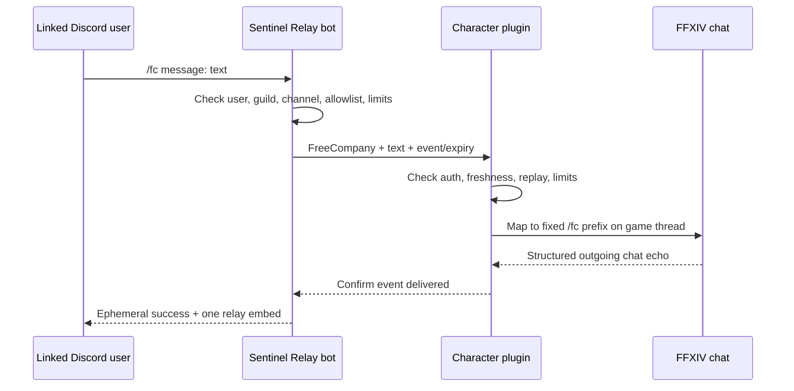

# Architecture

## Scope

Sentinel Relay is deliberately one system with two deployable components:

1. `SentinelRelay.dll`, loaded by Dalamud on each FFXIV PC.
2. `sentinel-relay-service`, a Node.js process that owns the Discord bot, WebSocket hub, and minimal SQLite link database.

Dreamforge is not involved. Wrothy and Elektra each use an independent character profile, credential, WebSocket session, Discord user, and relay channel.

No port is opened on either game PC. Both clients initiate ordinary TLS WebSocket connections to the hosted service.

## Component responsibilities

| Concern | Dalamud plugin | Relay service |
|---|---|---|
| Identify active character | `IPlayerState` character name, Content ID, home world | Verify saved character key against the credential-bound link |
| Receive FFXIV chat | `IChatGui.ChatMessage` and `XivChatType` | Never receives disabled channel data |
| Filter channels/keywords | Local per-character configuration | Deliver prefiltered event and alert instructions |
| Sanitize FFXIV data | Convert `SeString.TextValue` and player payload to plain text | Validate structured payload/size/freshness again |
| Discord routing | None | Exact link → guild → channel mapping |
| Discord authorization | Credential-bound WebSocket | Exact linked Discord user and configured channel |
| Send real FFXIV chat | Main-thread fixed channel mapping | Send enum + text only; await acknowledgement |
| Secrets | DPAPI-protected client token only | Bot token from environment; client-token hashes in SQLite |
| Persistence | Dalamud config, per character | Link/routing metadata only; no chat history |

## Current Dalamud API choices

- **Lifecycle/configuration:** `IDalamudPlugin`, `IDalamudPluginInterface.GetPluginConfig`, and `SavePluginConfig`.
- **Incoming chat:** `IChatGui.ChatMessage`, with structured `XivChatType`, sender `SeString`, message `SeString`, and `PlayerPayload` world where available. The visible chat window is not scraped.
- **Character identity:** `IPlayerState.CharacterName`, `ContentId`, and `HomeWorld`. Character profiles are keyed by the player's own Content ID, not by a typed display name; home world remains part of the displayed and authenticated profile metadata.
- **Commands:** `ICommandManager` for `/srelay`.
- **UI:** Dalamud `WindowSystem` and ImGui bindings.
- **Threading:** network and JSON I/O run on background tasks; `IFramework.Update` executes only the final game-chat send and small queued state transitions on the game thread.
- **Outbound chat:** `FFXIVClientStructs` `RaptureShellModule.ExecuteCommandInner` with a plugin-owned fixed prefix mapping. `IChatGui.Print` is intentionally not used as a substitute because it prints locally and does not transmit a chat message.

The outbound function is an unsafe game-client structure call, not a stable high-level Dalamud chat-send service. API 15 compilation proves current symbol compatibility, but only a live multi-client FFXIV test can prove the function still produces server-visible chat. Game updates can break it; failure is reported rather than falling back to a fake local print.

## Channel mapping

Incoming mappings use current `XivChatType` values for Say, Yell, Shout, Tell incoming/outgoing, Party/CrossParty, Alliance, Free Company, PvP Team, LS 1–8, CWLS 1–8, Novice Network, and standard/custom emotes.

Outbound Discord payloads contain only these enums:

`Say`, `Yell`, `Shout`, `Party`, `Alliance`, `FreeCompany`, `PvPTeam`, `Linkshell1..8`, and `CrossWorldLinkshell1..8`.

The plugin maps those internally to the canonical full FFXIV commands `/say`, `/yell`, `/shout`, `/party`, `/alliance`, `/freecompany`, `/pvpteam`, `/linkshell1..8`, and `/cwlinkshell1..8`. Tell, Novice Network, emotes, and arbitrary command strings have no outbound mapping.

## Inbound path: FFXIV → Discord

1. Dalamud raises a structured chat event.
2. The plugin maps `XivChatType` to a Sentinel enum.
3. Outbound-echo correlation gets first refusal; a matching Discord-originated echo is acknowledged and suppressed.
4. The active character profile is checked for pause state and explicit channel enablement.
5. Sender/message are converted to safe plain text and keyword rules run locally.
6. A bounded, 15-second in-memory queue hands a structured event to the WebSocket task.
7. The server authenticates installation + token, rejects stale/replayed events, resolves only that installation's link, and posts a compact embed to only that configured channel.
8. One bundled keyword notification is optionally delivered by DM and/or mention.
9. Neither component writes the chat body to persistent storage.

## Outbound path: Discord → FFXIV

If the plugin does not observe the real matching FFXIV echo within six seconds, it reports failure. The backend times out after nine seconds. A stale packet expires at twenty seconds, queues are capped, and offline clients receive no backlog dump.

## Pairing protocol

1. The connected unlinked client requests a code.
2. The service creates an eight-character, 40-bit cryptographically random code and retains it only in process memory, indexed by a hash and bound to that session, for ten minutes.
3. `/relay link` must present that code while the generating socket is still open.
4. The service binds installation ID, character key, Discord user, and a fresh 256-bit bearer token.
5. The plaintext token is shown to the plugin exactly once. The server stores its SHA-256 hash; the plugin stores a DPAPI-protected blob.
6. Future `hello` packets must present installation ID, the token, and the same character key.
7. Unlink deletes the database row and revokes the live session.

One Discord user can have one V1 link. That deliberate database constraint prevents a single account from accidentally controlling both initial characters.

## Resilience

- Client reconnect delay grows exponentially from about 1 to 60 seconds with jitter.
- WebSocket keepalive is 20 seconds.
- Network work never blocks the game/framework thread.
- Inbound client events expire after 15 seconds and the bounded queue does not accumulate an hours-old replay dump.
- Discord-originated messages expire after 20 seconds and local outbound queue depth is five.
- A new session for the same installation replaces the old socket.
- Discord offline status uses a 30-second grace period to avoid reconnect noise.
- The service handles `SIGINT`/`SIGTERM`, closes sockets, stops Discord, closes SQLite, and lets the host restart it.

## Persistence schema

The single `links` table stores:

- installation ID and token hash
- character key, name, and home world
- linked Discord user ID/name
- guild/channel ID/name
- pause flag and creation/update/last-seen timestamps

It stores no FFXIV chat messages, Discord command messages, keyword lists, or plaintext credentials. Keyword rules stay only in Dalamud's per-character local configuration.

## Scaling boundary

The current single process is intentionally sized for two clients. More modest users can be added vertically. Horizontal replicas would require shared live-session coordination, a shared rate-limit/replay store, and a network database; running two current replicas would misroute acknowledgements and is unsupported.
